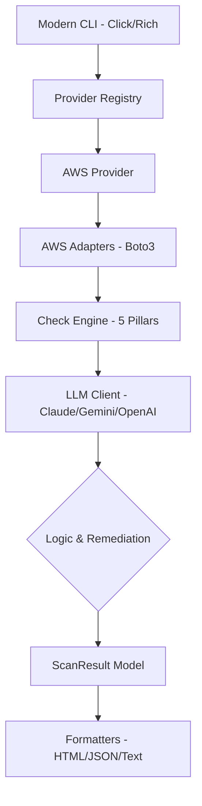

# 🛠 Infra Review CLI

**Infra Review CLI** is a professional, high-fidelity AWS infrastructure scanner designed to audit your cloud environment against the **AWS Well-Architected Framework**. It combines deep infrastructure inspection with **AI-powered intelligence** to provide actionable remediation steps, cost-saving recommendations, and executive-level reporting.

---

## 🌟 Key Features

- **✅ 5-Pillar Well-Architected Audit:** 20+ comprehensive checks across Security, Cost, Reliability, Performance, and Operational Excellence.
- **🧠 AI-Powered Insights:** Automatically generates executive summaries and technical remediation steps using **Claude-3.5**, **Gemini-2.0**, or **GPT-4o**.
- **📊 Advanced Scoring:** Get a weighted health score (0-100) for each pillar and your overall infrastructure.
- **🎨 Premium Reporting:** Stakeholder-ready HTML dashboards with Tailwind CSS styling and mobile-responsive design.
- **☁️ Multi-Provider Ready:** Built with a provider-agnostic core, ready to extend to GCP and Azure.
- **🚀 Modern UX:** Interactive CLI with real-time progress bars, color-coded summaries, and interactive prompts.

---

## 🚀 Quick Start

### Prerequisites
- Python 3.11+
- [Poetry](https://python-poetry.org/)
- AWS Credentials configured in your environment

### Installation
```bash
git clone https://github.com/rachealIC/infra-review-cli.git
cd infra-review-cli
poetry install
```

### Basic Usage
```bash
# Run an interactive scan (Guided setup)
poetry run cli check aws --interactive

# Quick scan with HTML output
poetry run cli check aws --format html

# Targeted scan for specific pillars
poetry run cli check aws --pillar Security --pillar Cost
```

---

## 🛡️ Supported Checks

| Service | Category | Description |
| :--- | :--- | :--- |
| **IAM** | Security | MFA enforcement, Root account activity, Access key rotation |
| **S3** | Security | Public bucket discovery, Policy/ACL audit, Versioning status |
| **VPC** | Security | Insecure security group rules (SSH/RDP/DB ports exposed) |
| **EC2** | Cost/Perf | Rightsizing (CPU/Memory), ASG coverage, Orphaned EBS/EIPs |
| **RDS** | Reliability | Multi-AZ status, Automated backup retention policy |
| **ECS** | Perf/Cost | Task definition drift, Service scaling, Root container audit |
| **CloudFront**| Performance| WAF coverage, Public origin protection |
| **Lambda** | Operation | Static secret detection in environment variables |

---

## 🔐 Sustainability Check IAM Permissions

To fully run Sustainability pillar checks, allow these read-only permissions:

- `ec2:DescribeInstances`
- `ec2:DescribeVolumes`
- `s3:ListAllMyBuckets`
- `s3:GetLifecycleConfiguration`
- `lambda:ListFunctions`
- `cloudwatch:GetMetricStatistics`
- `logs:StartQuery`
- `logs:GetQueryResults`

If these are missing, Sustainability can appear as **NOT SCANNED**.

---

## 🏗️ Architecture



---

## ⚙️ Configuration

Configure the tool via environment variables or a `.env` file:

| Variable | Description |
| :--- | :--- |
| `ANTHROPIC_API_KEY` | (Optional) Primary AI for remediation |
| `GEMINI_API_KEY` | (Optional) Fallback AI |
| `OPENAI_API_KEY` | (Optional) Fallback AI |
| `AWS_PROFILE` | AWS credentials profile to use |

---

## 🤝 Contributing

We welcome contributions! Please see our [Contributing Guide](CONTRIBUTING.md) for details on how to add new checks or providers.

---

## 📄 License
This project is licensed under the MIT License - see the [LICENSE](LICENSE) file for details.
